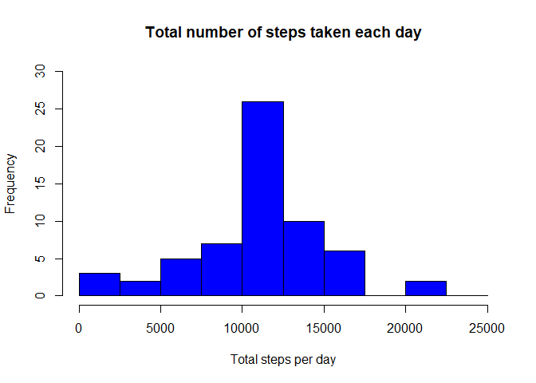

What is mean total number of steps taken per day?
-------------------------------------------------

Histogram
=========

    newdata <- summarize(group_by(data, date), sum(steps))

    ## `summarise()` ungrouping output (override with `.groups` argument)

    names(newdata) <- c("date", "steps")
    newdata <- na.omit(newdata)
    hist(newdata$steps, main = "Total number of steps taken per day", xlab = "Total steps taken per day", 
         col = "darkblue", ylim = c(0,20), breaks = seq(0,25000, by=2500))

Mean and median
===============

    mean(newdata$steps)

    ## [1] 10766.19

    median(newdata$steps)

    ## [1] 10765

What is the average daily activity pattern?
-------------------------------------------

Make a time series plot of the 5-minute interval and the average number of steps taken, averaged across all days
================================================================================================================

    intervaldata <- aggregate(activity$steps, by=list(activity$interval), FUN=mean, na.rm=TRUE) 
    names(intervaldata) <- c("interval", "mean")
    plot(intervaldata$interval, intervaldata$mean, type = "l", col="darkblue", lwd = 2, 
         xlab="Interval", ylab="Average number of steps", main="Average number of steps per intervals")

Which 5-minute interval, on average across all the days in the dataset, contains the maximum number of steps?
=============================================================================================================

    intervaldata[which.max(intervaldata$mean), ]$interval

    ## [1] 835

Imputing missing values
-----------------------

Calculate and report the total number of missing values in the dataset
======================================================================

    sum(is.na(data))

    ## [1] 2304

Devise a strategy for filling in all of the missing values in the dataset.
==========================================================================

    imputed_steps <- intervaldata$mean[match(data$interval, intervaldata$interval)]

Create a new dataset that is equal to the original dataset but with the missing data filled in.
===============================================================================================

    imputed_steps <- intervaldata$mean[match(data$interval, intervaldata$interval)]

Create a new dataset that is equal to the original dataset but with the missing data filled in.
===============================================================================================

    activity_imputed <- transform(activity, steps = ifelse(is.na(activity$steps), 
                                                           yes = imputed_steps, no = activity$steps))
    total_imputed <- aggregate(steps ~ date, activity_imputed, sum)
    names(total_imputed) <- c("date", "daily_steps")

Make a histogram of the total number of steps taken each day and Calculate and report the mean and median total number of steps taken per day.
==============================================================================================================================================

    hist(total_imputed$daily_steps, col = "blue", xlab = "Total steps per day", ylim = c(0,30), 
         main = "Total number of steps taken each day", breaks = seq(0,25000,by=2500))

mean and median
===============

    mean(total_imputed$daily_steps)

    ## [1] 10766.19

    median(total_imputed$daily_steps)

    ## [1] 10766.19

Are there differences in activity patterns between weekdays and weekends?
-------------------------------------------------------------------------

Create a new factor variable in the dataset with two levels: “weekday” and “weekend” indicating whether a given date is a weekday or weekend day.
=================================================================================================================================================

    data$date <- as.Date(strptime(activity$date, format="%Y-%m-%d"))
    data$datetype <- sapply(data$date, function(x) {
            if (weekdays(x) == "Saturday" | weekdays(x) =="Sunday") 
            {y <- "Weekend"} else 
            {y <- "Weekday"}
            y
    })

Make a panel plot containing a time series plot of the 5-minute interval and the average number of steps taken, averaged across all weekday days or weekend days.
=================================================================================================================================================================

    activitydate <- aggregate(steps~interval + datetype, data, mean, na.rm = TRUE)
    plot <- ggplot(activitydate, aes(x = interval , y = steps, color = datetype)) +
            geom_line() +
            labs(title = "Average daily steps by type of date", x = "Interval", y = "Average number of steps") +
            facet_wrap(~datetype, ncol = 1, nrow=2)
    print(plot)

